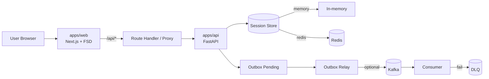
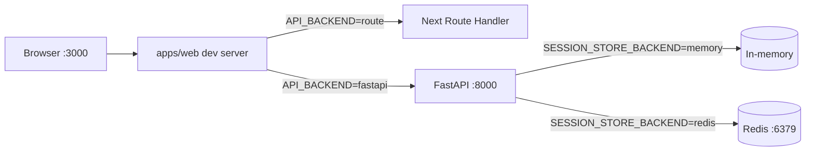
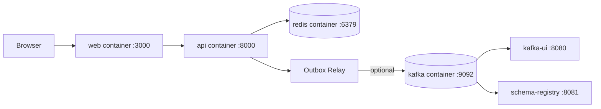

# Architecture Overview

이 문서는 현재 모노레포의 핵심 런타임 경로를 한 장으로 설명합니다.

## 1) Runtime Flow

## 2) Component Roles

- `apps/web`: 사용자 진입점, FSD 레이어 구조 유지
- `apps/api`: 인증/세션/프로젝트 API 및 outbox 처리
- `Redis`: 세션/로그인 제한 저장소
- `Kafka`: outbox relay가 활성화된 경우 이벤트 파이프라인 담당
- `Sentry`: FE/BE 에러 및 샘플링 기반 성능 트랜잭션 수집
- `packages/contracts`: FE/BE 공용 계약(schema/type) 관리

## 3) Operation Modes

- `API_BACKEND=route`: 웹 라우트 중심 모드
- `API_BACKEND=fastapi`: 웹이 FastAPI로 프록시
- 기본 compose(`docker compose up --build`)는 `OUTBOX_RELAY_ENABLED=false`
- Kafka 포함 스택(`npm run containers:up`)에서는 outbox relay 경로를 함께 검증

## 4) Local Run Path (`npm run dev` 중심)

- 기본 빠른 시작: `npm run dev`
- FastAPI 연동 시: `API_BACKEND=fastapi`, `FASTAPI_BASE_URL=http://localhost:8000`

## 5) Docker Run Path (`docker compose` / `containers:up`)

- 앱 컨테이너: `docker compose up --build`
- 앱+Kafka: `npm run containers:up`
- Kafka 토픽은 `kafka-topics-init` one-shot 컨테이너에서 자동 bootstrap
